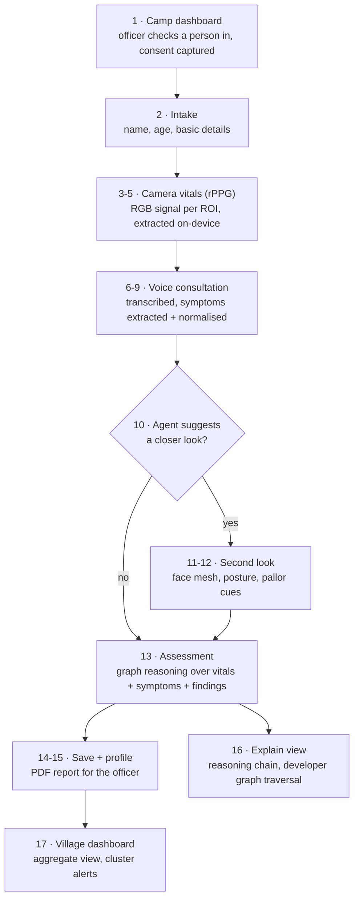
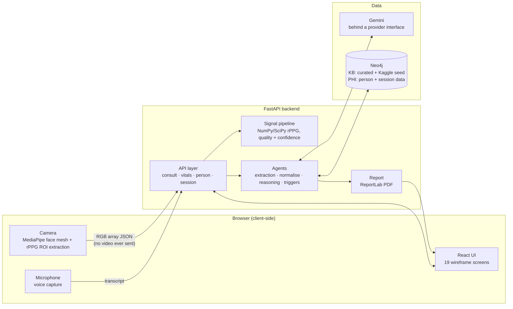

# Sanjeevani.AI

**A phone camera and a conversation, turned into a structured health screening.**

At a rural health camp, one officer and one phone can only see so many people a day,
and paper triage misses the quiet cases. Sanjeevani.AI runs on any browser: point the
camera, talk to the person, and in a few minutes get vitals, extracted symptoms, and
a reasoned set of screening considerations with recommended follow-up tests — every
claim traceable back to a knowledge graph, never a diagnosis, never a black box.

## About this build

This repository is a **hackathon demo**: a working, browser-based prototype built
to prove the end-to-end idea — real rPPG signal processing, a real knowledge graph,
a real conversational pipeline — rather than a mocked walkthrough. It runs the full
loop from camera to graph reasoning to report on a single machine via
`docker compose`, seeded with public and curated data so the golden path works
without any live health-camp deployment. Some screens (village dashboard, developer
graph explorer) are functional but intentionally lightweight for the demo; see
[progress.md](progress.md) for the exact state of every screen and pipeline stage.

## Workflow



## System architecture



## How it works

1. **Camera vitals (rPPG)** — the browser extracts mean RGB per region of interest
   per frame client-side and posts a small JSON signal array (no video ever leaves
   the device). The backend derives heart rate, breathing rate, and blood-pressure
   *trend* from it, each with a quality score and confidence tier.
2. **Voice consultation** — a guided conversation is transcribed and the symptoms
   are extracted and normalised to canonical terms against the knowledge graph.
3. **Second look** — face mesh and posture cues (pallor, guided motion) add
   probabilistic findings, each carrying a confidence value.
4. **Knowledge-graph reasoning** — findings are traversed against a Neo4j graph
   seeded from a curated rural-India layer plus a public Kaggle symptom dataset,
   producing screening considerations and recommended follow-up tests with an
   explainable reasoning chain (Screen 16 / developer mode).
5. **Report + village view** — a PDF summary for the officer, a per-person profile,
   and an aggregate village dashboard that can surface outbreak-style clusters.

## Stack

Backend: Python 3.11, FastAPI, NumPy/SciPy/OpenCV (rPPG), Neo4j, Gemini (behind a
provider interface), scikit-learn, ReportLab.
Frontend: React 18, Vite, TypeScript, Tailwind, MediaPipe Tasks (WASM), react-i18next
(English, Telugu, Hindi).

## Docs (read in this order)

| File | Purpose |
|---|---|
| [CLAUDE.md](CLAUDE.md) | Entry point for every coding session — rules, conventions, hand-off protocol |
| [progress.md](progress.md) | What is done, stubbed, decided, open. Updated every phase |
| [architecture.md](architecture.md) | System design, graph model, seed data, memory model |
| [specs.md](specs.md) | Screens, API contracts, rPPG spec, knowledge base, copy rules |
| [frontend/ui-reference/sanjeevani-flow.html](frontend/ui-reference/sanjeevani-flow.html) | The wireframe — visual source of truth (open in a browser, ← / → to navigate) |

## Data

`data/seed/kaggle/` — raw Kaggle disease-symptom dataset, never hand-edited.
`data/seed/curated/` — hand-written rural-India layer.

## Run

```bash
docker compose up
```

Copy `.env.example` to `.env` and fill in a `GEMINI_API_KEY` first. The frontend
serves at the Vite dev port and talks to the FastAPI backend; Neo4j runs as a
compose service and is seeded on first boot.

## Absolute rules

No camera-derived diagnosis, no absolute blood-pressure mmHg values, no
haemoglobin-from-camera estimation, no composite health score, no video leaving
the device. Every vital and every graph edge ships with a confidence tier. See
[CLAUDE.md](CLAUDE.md) for the full list.

## Roadmap

This demo proves the pipeline end-to-end on a laptop with seed data. The planned
production app takes every piece shown here — rPPG vitals, voice consultation,
graph reasoning, reporting, village-level aggregation, multilingual support — and
ships it as a **fully functional mobile/web application**, hardened for real
health-camp use: offline-tolerant sync, a clinician-reviewed knowledge base at
full scale, and hospital/EHR integration for the recommended follow-up tests.
